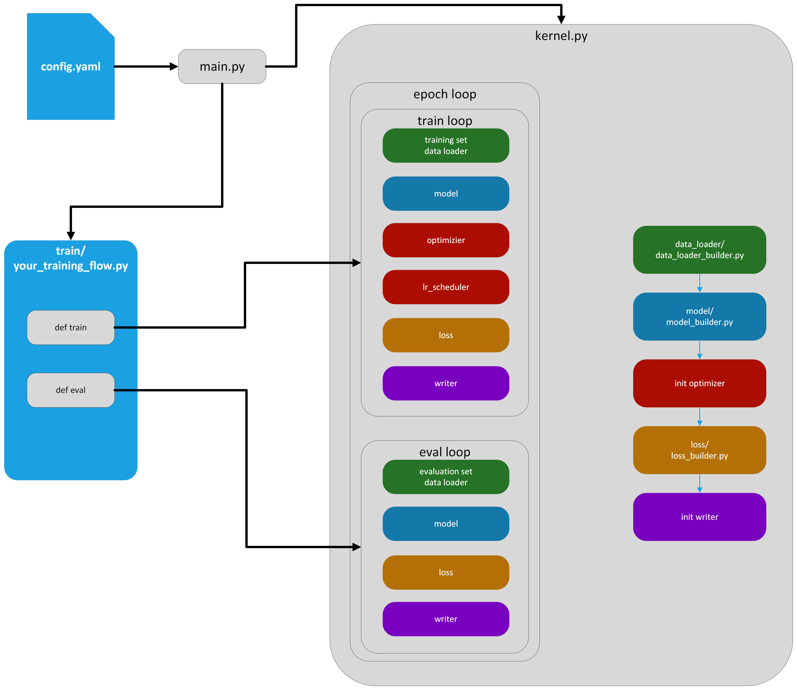

# iem_pytorch

# overall
## Features
- use pytroch training more easily.
- configuration and recording setting more easily.
- support all pytorch function.
## Description
This repo is for model training by use pytorch.

## How to used
1. Write tour training flow in `train`, and defined your own `train()` and `eval()`
2. Write your config.yaml
3. run `python main.py -c config.yaml -d DEVICE`
## Architecture
This framework is built for training and configuration more easily.
In iem_pytorch, there is some builder and function to build the component for DeepLearning training.
- data/data_loader_builder.py: build the data_loader and normalizer.
- init optimizer: build optimizer and lr_scheduler.
- model/model_builder.py: build your model.
- losss/loss_builder.py: build your loss functions.
- init wrtier: setup the tensorboard and build a container for plot some custom metrics.


# MLflow
This repo is also support [mlflow](https://mlflow.org/). If you want to use mlflow, follow this toturial.
## 1. Run mlflow on your terminal
```bash
mlflow ui
```
you could view it at http://localhost:5000.

## 2. Change training config
```yaml
mkflow_uri: "http://localhost:5000"
```

# About config
## Architecture
Config would be writed several part.
1. path and mlflow setting
2. params
3. training settings
4. data
5. optimizer
6. model
7. loss
8. evaluator

## path and mlflow setting
```yaml
mkflow_uri: url to mlflow service
experiment_name: experiment would be create or setting for mlflow
run_name: run_name for mlflow
experiment_dir: the local path to save model and tensorboard
```
The files would be saved to the path `experiment_dir/experiment_name/run_name`.

## params
```yaml
params:
    batch_size: &batch_size
```
You could set some parameters at this part for different config testing and monitor these information on MLflow UI.

## training settings
```yaml
training_settings:
    kernel: python object in iem_pytorch/train
    mode: "train_eval"
    device: 0
    max_epoch: *me
    pretrained_model:
```
This file would controll your training. If you want some fashion training, you can modify this file.

## data
```yaml
training: path to training data, datatype is based on your custom dataloader
testing: path to training data, datatype is based on your custom dataloader
normalizer:
    model: python object in iem_pytorch/normalization
    args: the arguments based in your custom normalizer
dataset:
    train:
        model: python object in iem_pytorch/data_loader
        args: the arguments based in your custom data_loader
        outputs: name of the outputs tensor name (List)
    eval:
        model: python object in iem_pytorch/data_loader
        args: the arguments based in your custom data_loader
        outputs: name of the outputs tensor name (List)
 ```

## optimizer
This repo is only support `adamw` and `CosineAnnealingWarmupRestarts` now.
```yaml
optimizer:
    model: pytorch optimizer
    args: arguments of optimizer
lr_scheduler:
    model: python object in iem_pytorch/lr_scheduler
    args:
        max_lr: *max_lr
        min_lr: *min_lr
```
In this part, you can use pytorch module as model like `pytorch.XXXX`.

## model
```yaml
inputs: inputs tensor name (List) correspond to `dataset/train(eval)/outputs`
outputs: outputs tensor name (List) from model
layers: 
    - name: model name. not used in this repo
      model: python object in iem_pytorch/model
      args: the arguments based in your custom model
      inputs: inputs tensor name (List)
      outputs: outputs tensor name (List)
```
iem_pytorch would use `iem_pytorch/model/model_builder.py` to build a model from this part settings. Then the model would be built by layers ordering like a graph.
In this part, you can use pytorch module as model like `pytorch.XXXX`.
## loss
```yaml
layers:
    - name: model name. not used in this repo
      model: python object in iem_pytorch/loss
      args: the arguments based in your custom model
      inputs: inputs tensor name (List)
      outputs: outputs tensor name (List)
```
In this part, you can use pytorch module as model like `pytorch.XXXX`.

## evaluator
```yaml
include: inputs tensor name (List)
metricts:
    - name: model name
      writer: the tensorboard
      model: python object in iem_pytorch/evaluator
      args: the arguments based in your custom model
```
You could write some metric to save to tensorboard.

 